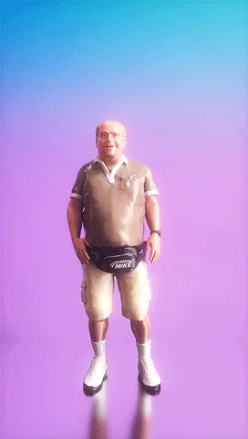
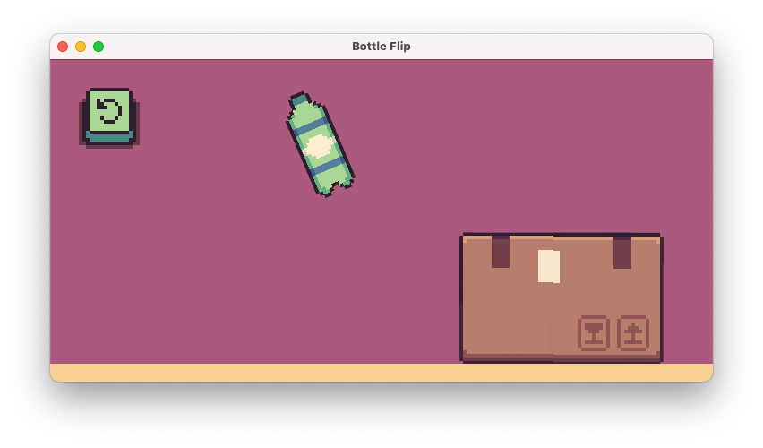
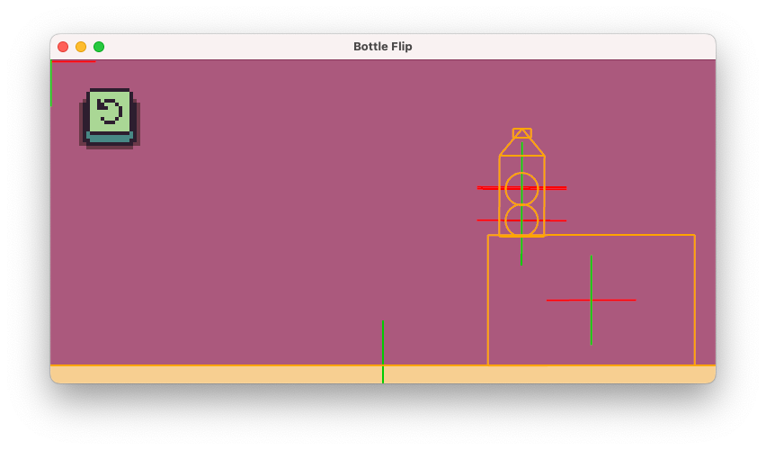

# Bottle Flip

Blast from the 2010s... Here's a bottle flip game prototype with somewhat realistic physics. Written in [Rust](https://www.rust-lang.org/) using the [Bevy game engine](https://bevyengine.org/) and the [Avian physics library](https://docs.rs/avian2d/latest/avian2d/). Made with ❤ 

## How does it work?
According to [Wikipedia](https://en.wikipedia.org/wiki/Bottle_flipping), the complex physics behind bottle flipping incorporates concepts of fluid dynamics, projectile motion, angular momentum, centripetal force, and gravity. Whoa!

## Fortunately things can be simplified. 
Apparently a gazillion of teeny water particles in a bottle can be simulated by just having two huge ones. Tossing a bottle partially filled with water essentially acts in the same way as a tube with two tennis balls, as described in the paper ["Water bottle flipping physics"](https://pubs.aip.org/aapt/ajp/article-abstract/86/10/733/1057911/Water-bottle-flipping-physics) by Dekker et al., 2018.

## Demo
Available on [itch.io](https://claudijo.itch.io/bottle-flip)

## License
MIT License
  ([LICENSE-MIT](LICENSE-MIT) or <http://opensource.org/licenses/MIT>)
